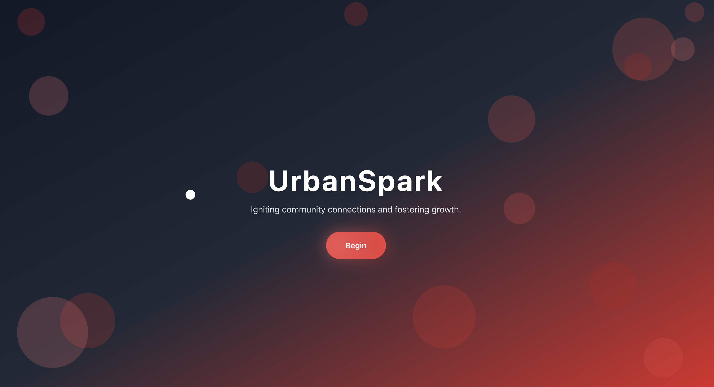
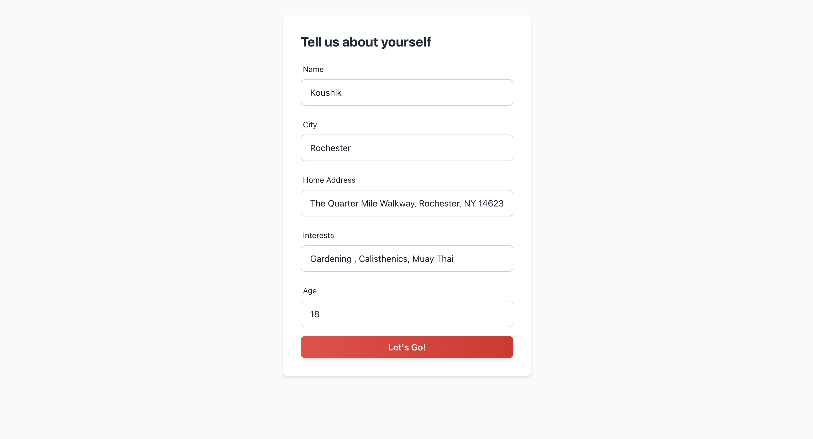

# UrbanSpark- HackRPI Hackathon
UrbanSpark is an AI-powered platform designed to connect young adults with local opportunities in urban environments. By using a React front-end, FastAPI backend, and the OpenAI and Serp APIs, it delivers personalized recommendations for internships, educational programs, and volunteer work based on user interests and location. The platform overcomes the challenge of information overload by curating relevant opportunities, especially for low-income or disabled individuals, through AI-driven query generation and result summarization. Built during HackRPI 2024, UrbanSpark aims to empower users to engage with their city and build valuable skills.

# Preview: 
 
 

## Live Demo:
https://devpost.com/software/urbanspark 
